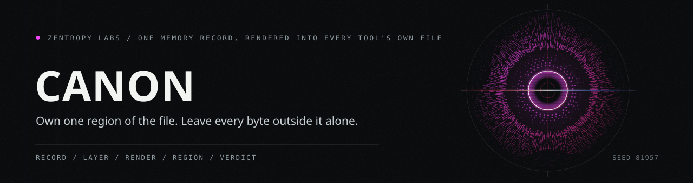

# canon

One record for your memory bank and your personality, shared across every model
and every tool.



You keep the same working relationship whether you open Claude Code, Claude CLI,
ChatGPT, Codex, or a web surface: the same authored voice, the same accumulated
memory, the same decisions. Today that lives in a dozen files with a dozen
shapes (`CLAUDE.md`, `AGENTS.md`, `SOUL.md`, `GEMINI.md`) plus per-tool memory
stores that do not talk to each other. canon gives all of them one typed record
to draw from and write back to, and renders each tool's file from that record.

## What it does

- **One envelope, five kinds.** An authored personality block, a raw or extracted
  memory, a synthesized persona, a decision record, and a reference to an
  external research artifact all share one record shape with a provenance
  receipt on every entry.
- **Two scopes that layer.** A `global` block is your default everywhere; a
  `workspace` block with the same id overrides it where that workspace applies.
  A render resolves the effective set for its target, current entries only.
- **Deterministic by construction.** Ordering uses a clock-free ordinal, so a
  rebuild from the same records is byte-identical. The wall clock is kept only
  as a non-authoritative convenience.
- **An assembly, not a rewrite.** canon aims at proven engines rather than
  replacing them: a memory fact-engine, an authored-block store, and a
  cross-provider transport. It adds the one record they share and the renderer
  that projects each surface.

## How one record becomes the file each tool reads

![Eight stages taking one record to the file a tool reads: record, validate, layer, resolve, render, region, allow-list, write. Every entry is one envelope in one of five kinds: an authored personality block, an episodic memory, a synthesized persona, a decision record, and a reference to an external research artifact. The validator checks every field and refuses a record it cannot vouch for. A workspace block overrides a global block carrying the same id, and the resolve step keeps current entries only, ordered by a clock-free ordinal so a rebuild is byte-identical. The block set is rendered to text and spliced into the span between the canon begin and end markers, and every byte outside that span is preserved. The write allow-list holds four surfaces: a global and a workspace file for Claude Code, an AGENTS.md for Codex, and a workspace SOUL.md for Hermes. A path outside that list is refused, and so is a file with no canon region. Three outcomes: written inside the markers canon owns, a surface that drifted and needs a human, and a file canon declines to write at all.](docs/art/surface-lane.svg)

canon writes four paths and no others, and inside those four it rewrites only
the span between its own markers. A file with no canon region is left alone.

## How a rendered file is checked back against the record

![Eight stages checking a rendered file back against its record: read, extract, ingest, canonical, compare, drops, legs, verdict. The file is read as it sits on disk and the region between the canon markers is extracted byte exactly. The region text is ingested back into records, each reduced to one canonical form so the comparison is against a single shape rather than a formatting accident. The rendered form and the ingested form are compared field by field. Every field that failed to survive is classified against the losses that storage adapter declared in advance, and a loss nobody declared is a refusal. The aggregate check folds four legs: surface drift, the vault round-trip, the vault read symmetry, and the persona assessment. A leg whose seam is not wired reports nothing and does not affect the result. The verdict is one exit code, zero when every wired leg passed and one otherwise, and all four gate functions in the codebase share that signature so a build keys on them the same way. Three outcomes: the record survives the file, a declared drop that was named in advance, and a refusal that returns a nonzero code.](docs/art/verdict-lane.svg)

A round-trip that loses a field passes only when the adapter declared that loss
in advance. Anything else fails the gate rather than logging a warning.

## What canon carries

![A table of twelve rows: what canon carries, how many of it there are, and where each number is read from. Five record kinds share one envelope. Two scopes layer, workspace over global. Four surfaces sit on the write allow-list: a global and a workspace file for Claude Code, an AGENTS.md for Codex, and a workspace SOUL.md for Hermes. Four storage adapters implement the backend protocol, and five capability tokens describe what each one can carry. Sixteen schema pins name the seams that carry a version. The aggregate check folds four legs, and four gate functions share the same zero or one exit code. Thirty-four source modules hold five thousand five hundred and sixty-two lines, and thirty-five test files hold six hundred and seventy-six tests. Two surfaces named in the roadmap are absent from the catalog, a global SOUL.md and a GEMINI.md, so canon does not render them.](docs/art/record-table.svg)

Every count is asserted against the module that defines it in
`tests/test_repo_art.py`.

## Status

F0 is the record of record: the canonical schema, its validator, and the
per-scope layering. F1 adds the storage seam: a `MemoryBackend` protocol with
capability tokens and four adapters, among them a zero-drop SQLite reference and
injected-handle adapters for a memory fact-engine and an authored-block store.
R0 adds the block round-trip gate: a byte-exact region boundary inside a managed
file, a record-to-text renderer and its inverse, and a go/no-go verdict that
proves a block set round-trips to its canonical form with every dropped field
declared.

R1 renders your files from the record. It resolves the block set for a file's
scope and rewrites only the region canon owns, every byte outside it preserved.
It writes only a fixed allow-list of files, and only a file you have opted in
with a canon region. Where a tool reads both a global and a workspace file, the
workspace file carries just your workspace blocks, so a shared block is never
duplicated; where a tool reads one file, that file carries the full resolved set.

R2 mirrors your whole record set into an Obsidian vault. Each record becomes one
markdown note you can read, search, and link, and a MEMORY.md index lists them
all. The full record rides inside every note, so a rebuild is exact and editing a
note's prose never rewrites the record behind it. canon writes only inside its own
vault, never touches a file it did not write, and when you drop a record it
reports the note left behind rather than deleting it. R2 also adds SOUL.md to the
rendered surfaces.

V2 through V4 add the checks and the decision on top of them. A drift check
re-derives every managed surface and compares only the region canon owns, so
your own prose outside the markers is never flagged. A persona check reports
whether the memories behind a synthesized persona still resolve. V4 separates a
mechanical fast-forward from a conflict, writes the fast-forwards, and raises a
durable gate for anything a human should adjudicate.

Installing a region into a fresh file, the first migrator on the version seam,
and the global SOUL.md and GEMINI.md surfaces are later phases. Everything
shipped is proven by a full test suite and aims at the one envelope.

## Run it

```bash
python -m pytest
```

No runtime dependencies. Python 3.11 or newer.

## Layout

```
src/canon/
  schema.py, validator.py, layering.py   the record, its rules, per-scope resolve
  backends/                              the storage seam and four adapters
  region.py, textblock.py, fidelity.py   the byte boundary, the text codec, the gate
  surface.py, registry.py                the render composition, the write allow-list
  frontmatter.py, vault.py               the note frontmatter codec, the one-record note
  vault_mirror.py, vault_fidelity.py     the whole-vault mirror and its round-trip gate
  drift.py, writing_gate.py              the surface drift check, the injected prose gate
  persona_thesis.py, canon_check.py      the persona basis adapter, the aggregate check
  reconcile*.py                          the fast-forward decision and its durable gate
tests/                                   round-trip, validator, layering, backend,
                                         fidelity, surface, orchestration, vault,
                                         drift, reconcile, and artwork proofs
docs/art/                                the drawings above and the spec they render from
project-docs/                            the F0, F1, R0, R1, R2, V2, V3, and V4 decisions
```

See `project-docs/` for the schema reference, the layering derivation, the
section-ownership contract, the declared drops each storage backend must
announce, and the decisions behind the round-trip, vault, drift and reconcile
gates.

## License

FSL-1.1-MIT. Functional Source License, source-available now for any purpose
other than a competing product, and it converts to the MIT license two years
after each version is released. See `LICENSE`.
